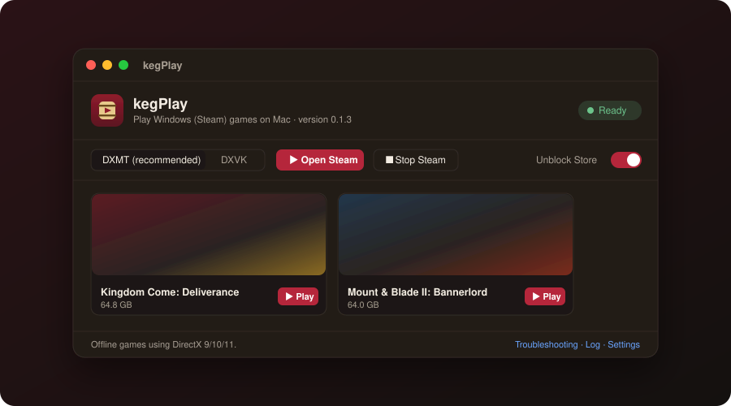

<div align="center">


# kegPlay

**Play your Windows Steam games on a Mac. Free and open source.**

[](https://github.com/tiengdung90/kegplay/releases/latest)
[](#requirements)
[](LICENSE)

[Website](https://kegplay.com) · [Download](https://github.com/tiengdung90/kegplay/releases/latest/download/Kegplay.dmg) · [Troubleshooting](https://kegplay.com/debug/) · [Tiếng Việt](https://kegplay.com/vi/)



</div>

## What it is

kegPlay is a small macOS app that sets up [Wine](https://www.winehq.org), a Windows environment and **Steam for Windows** with one button, then gets out of the way. You sign in to Steam, download your games, and play them on an Apple Silicon Mac.

It is a thin, readable layer of shell scripts with a SwiftUI front end. Nothing is installed system-wide: everything lives in one data folder that you can delete.

## Features

- **One-click setup.** Downloads Wine, creates the Windows environment and installs Steam for you.
- **Two graphics engines.** [DXMT](https://github.com/3Shain/dxmt) translates Direct3D 11 straight to Metal and is the default. [DXVK](https://github.com/Gcenx/DXVK-macOS) is the fallback for games that dislike DXMT. Switch with one click.
- **The Steam Store loads.** A built-in unblocker for networks that block the Store. It applies only to Steam inside kegPlay and never touches your Mac's network settings.
- **Sign-in that does not hang.** A DNS fallback steps in when an ISP's DNS refuses to resolve Steam's sign-in servers.
- **No input-method trouble.** Switches the keyboard to ABC while a game window is active and restores your input method when you leave.
- **Update notice.** The app tells you when a newer release is available.
- **Old DirectDraw games.** Supported titles from around 2000 that would fail with “Unable to set the video mode” are fixed automatically: kegPlay installs [cnc-ddraw](https://github.com/FunkyFr3sh/cnc-ddraw) into the game folder when you open Steam or press Play.
- **No Steam overlay surprises.** The overlay that Steam injects into games breaks several of them under Wine, so kegPlay keeps it out.
- **13 languages.** English, Vietnamese, Simplified Chinese, Japanese, Korean, Spanish, Portuguese (Brazil), German, French, Russian, Turkish, Indonesian and Thai.

## Requirements

- A Mac with Apple Silicon (M1 or newer)
- macOS 13 or later
- Rosetta 2 (if it is missing: `softwareupdate --install-rosetta`)
- About 3 GB of free space, plus room for your games
- A Steam account

## Install

1. Download [`Kegplay.dmg`](https://github.com/tiengdung90/kegplay/releases/latest/download/Kegplay.dmg) and drag **kegPlay** into your Applications folder.
2. Open it. The app is not notarized by Apple, so on first launch go to **System Settings › Privacy & Security** and click **Open Anyway**.
3. Click **Start setup** and wait a few minutes.
4. Click **Open Steam**, sign in, and download a game. Installed games appear in kegPlay with a **Play** button.

Quit Steam for Mac before you download games in kegPlay if both use the same account. Two clients on one account fight over the session.

## Tested games

| Game | Status | Notes |
|---|---|---|
| Kingdom Come: Deliverance | Runs smoothly | DXMT or DXVK |
| Mount & Blade II: Bannerlord | Runs smoothly | Use DXMT: the game's launcher needs a fix that only exists there |
| Command & Conquer: Red Alert 2 and Yuri's Revenge | Playable, in a window | kegPlay applies the [display fix](https://kegplay.com/debug/#ddraw-video-mode) and sets the game to your screen's resolution |

The list is short because the project is new. Offline games that use DirectX 9, 10 or 11 generally have a chance of running. Reports for other games are welcome in [Issues](https://github.com/tiengdung90/kegplay/issues).

## Not supported

- Games that need DirectX 12
- Games with anti-cheat, which covers most competitive online games
- Intel Macs

## How it works

```
 kegPlay.app (SwiftUI)
      │  runs
      ▼
 scripts/*.sh ── setup · install Steam · open / stop Steam · launch a game · switch engine
      │
      ├─ Wine 11.18 (x86-64, through Rosetta 2) with one Windows "bottle"
      │     ├─ DXMT   Direct3D 10/11 → Metal                (default)
      │     └─ DXVK   Direct3D 10/11 → Vulkan → MoltenVK → Metal
      ├─ SpoofDPI + a local PAC file     Steam Store unblocker, scoped to the bottle
      └─ dnsfallback.dylib               retries failed lookups against public DNS
```

Third-party components are downloaded from their authors' release pages on your machine. This repository does not redistribute Wine, DXMT, DXVK or Steam.

Two small pieces are shipped prebuilt so that users do not need a compiler:

- `prebuilt/cefwrap.exe` makes Steam's embedded browser start without GPU acceleration, which otherwise leaves the Steam window black under Wine. Source: `src/cefwrap/`.
- `engines/dxmt/lib/winemac.so` is Wine's macOS driver rebuilt with a bridge that DXMT needs and three OpenGL fixes. The patches are in `engines/dxmt/bridge/` and `engines/dxmt/build-winemac.sh` reproduces the build.

## Build from source

You need the Xcode Command Line Tools (`xcode-select --install`) and Python 3. Full Xcode is not required.

```bash
git clone https://github.com/tiengdung90/kegplay.git
cd kegplay
./tools/build-all.sh
```

This produces `dist/kegPlay.app` and `dist/Kegplay-<version>.dmg`. Add `--install` to copy the app into `/Applications` and open it.

Rebuilding the patched Wine driver is optional and needs Homebrew's `mingw-w64`, `bison` and `flex`. See `engines/dxmt/build-winemac.sh`.

## Repository layout

| Path | Contents |
|---|---|
| `app/` | The SwiftUI app |
| `scripts/` | Everything the app runs: setup, Steam, engines, unblocker, the DirectDraw fix for old games |
| `engines/` | DXMT bridge and patches, DXVK configuration |
| `src/` | Sources of the prebuilt helpers |
| `prebuilt/` | The prebuilt helpers |
| `tools/` | Build, localization and release scripts |

Code comments and script messages are written in Vietnamese. The app itself is localized.

## Troubleshooting

Known problems, their causes and fixes are collected at **[kegplay.com/debug](https://kegplay.com/debug/)**. The **Troubleshooting** link inside the app opens the same page.

If your problem is not listed, open an [issue](https://github.com/tiengdung90/kegplay/issues) and attach the log from the app's **Log** window.

## Credits

kegPlay stands on the work of [Wine](https://www.winehq.org), [DXMT](https://github.com/3Shain/dxmt), [DXVK](https://github.com/doitsujin/dxvk) and [DXVK-macOS](https://github.com/Gcenx/DXVK-macOS), [MoltenVK](https://github.com/KhronosGroup/MoltenVK), [SpoofDPI](https://github.com/xvzc/SpoofDPI) and the [macOS Wine builds](https://github.com/Gcenx/macOS_Wine_builds) by Gcenx. Licenses and source locations are listed in [THIRD-PARTY-NOTICES.txt](THIRD-PARTY-NOTICES.txt).

## License

kegPlay's own code is released under the [MIT License](LICENSE). The rebuilt Wine driver in `engines/dxmt/lib/` is under the LGPL 2.1 or later, like Wine.

kegPlay is not affiliated with Valve, Apple, Microsoft or CodeWeavers. Steam is a trademark of Valve Corporation. You need to own the games you play.
